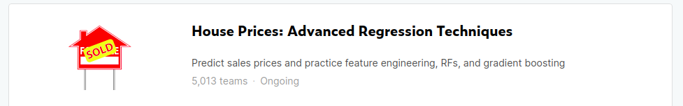
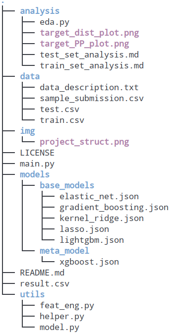

# kaggle-house-price-prediction
Although many of people have finished watching get-started video like Andrew ng's machine learning introduction on coursa. They still don't know what to do when competition. This repo is a brief introduction to what you should do when competition.



# Project Structure



Let's make an overview of this project:

1. **./analysis**: Store the eda visualization result.
2. **./data**: Store the data set.
3. **./img**: different from ./analysis. This folder's images is for README doc.
4. **./models**: Store all models' hyper parameters and parameters. (After you run this script, you can see a new folder named checkpoint in this directory.  This is where to store the parameters)
5. **./utils**: Store all the necessary helper script in this project. Such as feature engineering and modeling.
6. **main.py**: The whole process of the machine learning.
7. **result.csv**: The submission file of this competition.

# Build
We recommend using python3 and a virtual env. See instructions here.

```bash
virtualenv -p python3 .env
source .env/bin/activate
pip install -r requirements.txt
```

When you're done working on the project, deactivate the virtual environment with deactivate.

# Process

### Make a baseline

In machine learning field, it's well known that we are supposed to make a baseline at first. But what we should do when meeting those tabular data just like this house price prediction?

Actually, there are 4 things you need to do first:

1. **Get your data set.** this can simply implement by pandas api read_csv.
2. **Fill your missing value**. You can't make a progress without doing it.
3. **Feature engineering.** It convert your raw data into which the model can interpret.
4. **Choose a model and train it.** The most excited part of machine learning.
5. **Evaluate the predictions.** I don't tend to do that because you can see your scores on the leader board.
6. **Make a submission.** 

The most complex part is fill your missing values and feature engineering. For my own, I'd simply using pandas pad method to fill the missing values at first.

When making the baseline. There's no need to pay to much attention to feature engineering. So I just scale the numerical data and categorical data.

The model I choose at first is the simple linear regression model. I tend to choose a high bias and low variance model when making the baseline. And there are also many other benefits in the simple linear regression model. It's fast and don't need to much memory.

The other part is rather easy to implement. So there's no need to claim again.


### EDA

Well, when I was a rookie in machine learning, I can't explain why each notebook tend to do EDA. Now  I finally understand a bit. 

Many model such as glm, **have strict assumptions to the input variables and target variables.** In competition, we can't avoid using model ensemble at last. And the models we choose to ensemble is always include glm. So we must transform the data as its expected form.


### FE

Feature engineering is a dirty-hand work. In this project, I didn't do much feature engineering work. One thing you have to remember is that feature engineering is not only feature scaling and convert categorical feature into numerical form, but also **feature interaction(such as Cartesian Product) and feature selection**.

You can see many excellent FE work in kaggle's relevant notebook.


### Model ensemble

There are a lot of different way of model ensemble. I strongly recommend using stacking method and out-of-prediction at the same time.  It can improve your rank quickly.

If you want to build a more complicated model. **You can do model ensemble multiply times.** For example, take the model you use at first as a base model. And do simple model ensemble such as averaging with other base models.


### Other parts

In other parts, there are a lot of things you need to know:

1. when you get the data set, you should **directly separate the target variable**
2. Before training, **convert pandas object to numpy object**.
3. Remember to **reduce target variable** after target engineering.


# Reference

[1]. https://www.kaggle.com/pmarcelino/comprehensive-data-exploration-with-python

[2].https://www.kaggle.com/serigne/stacked-regressions-top-4-on-leaderboard

[3]. https://www.kaggle.com/masumrumi/a-detailed-regression-guide-with-house-pricing

[4]. https://en.wikipedia.org/wiki/Generalized_linear_model
